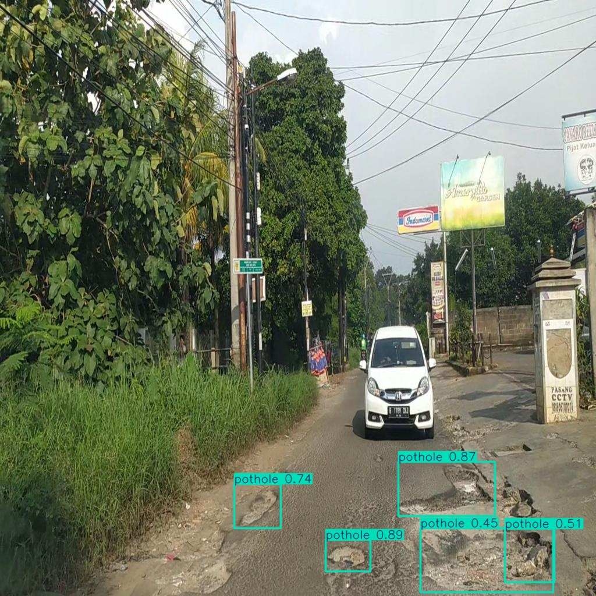
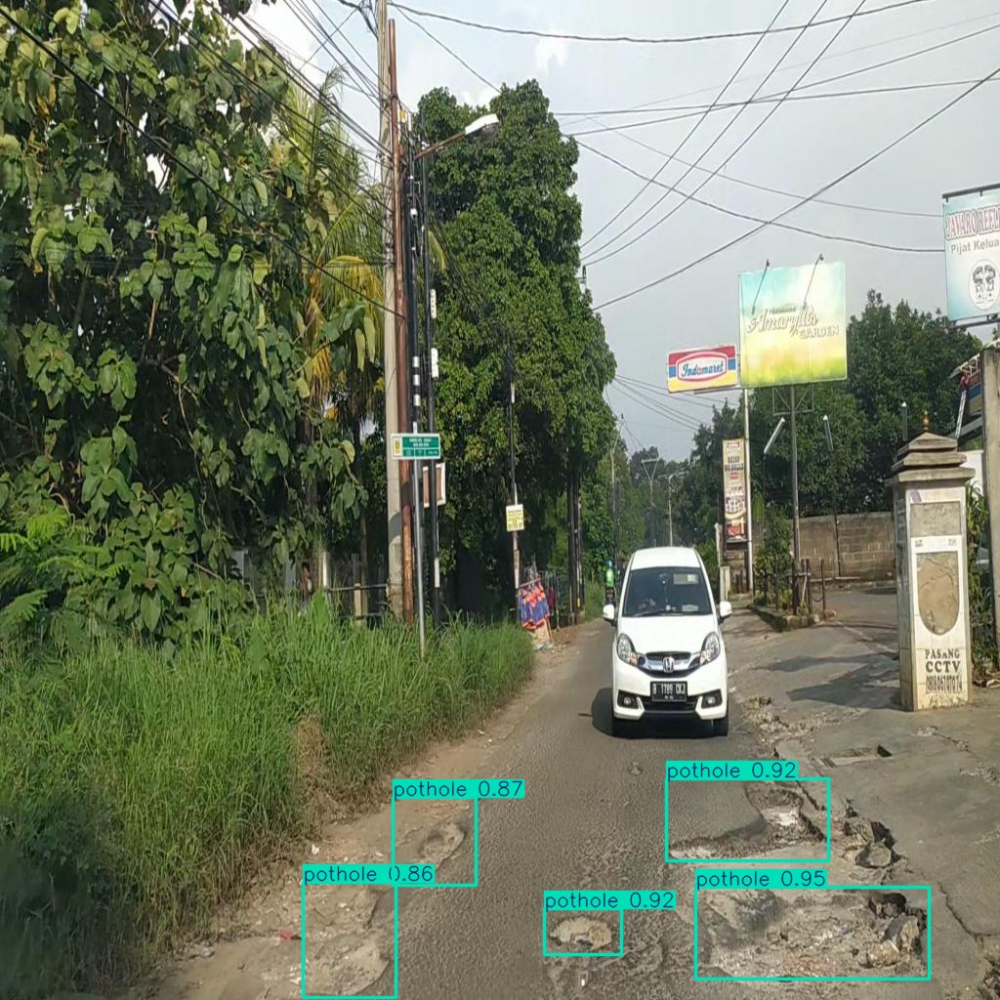
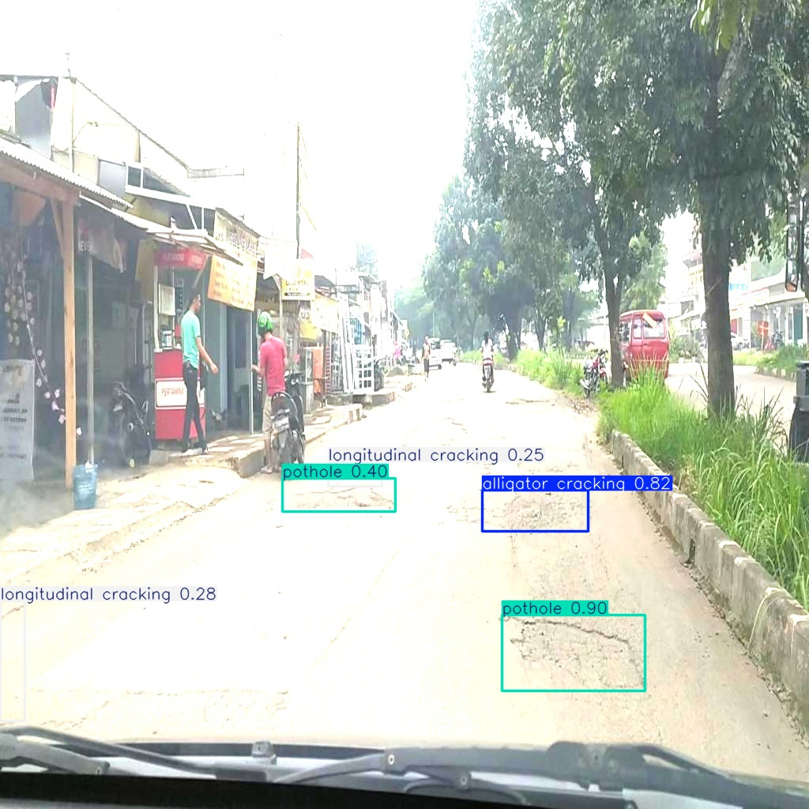
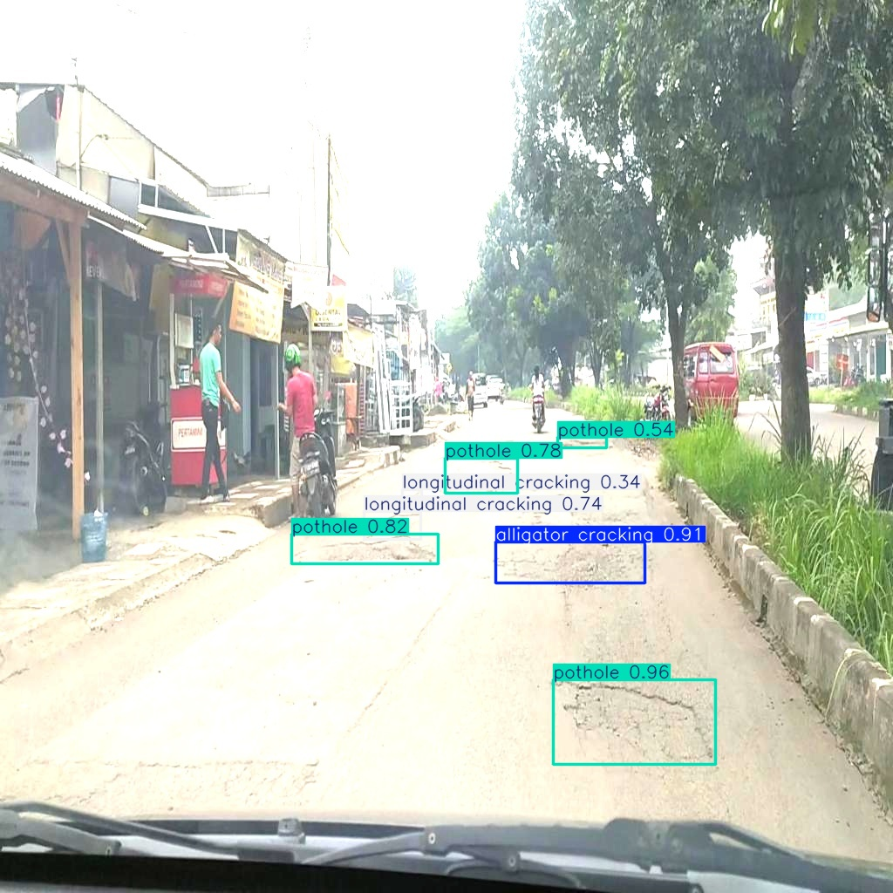
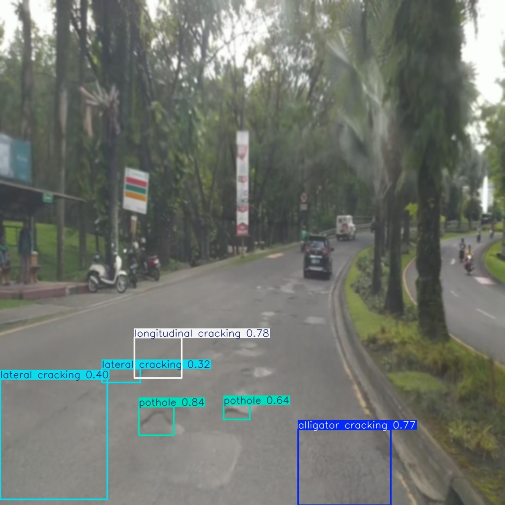
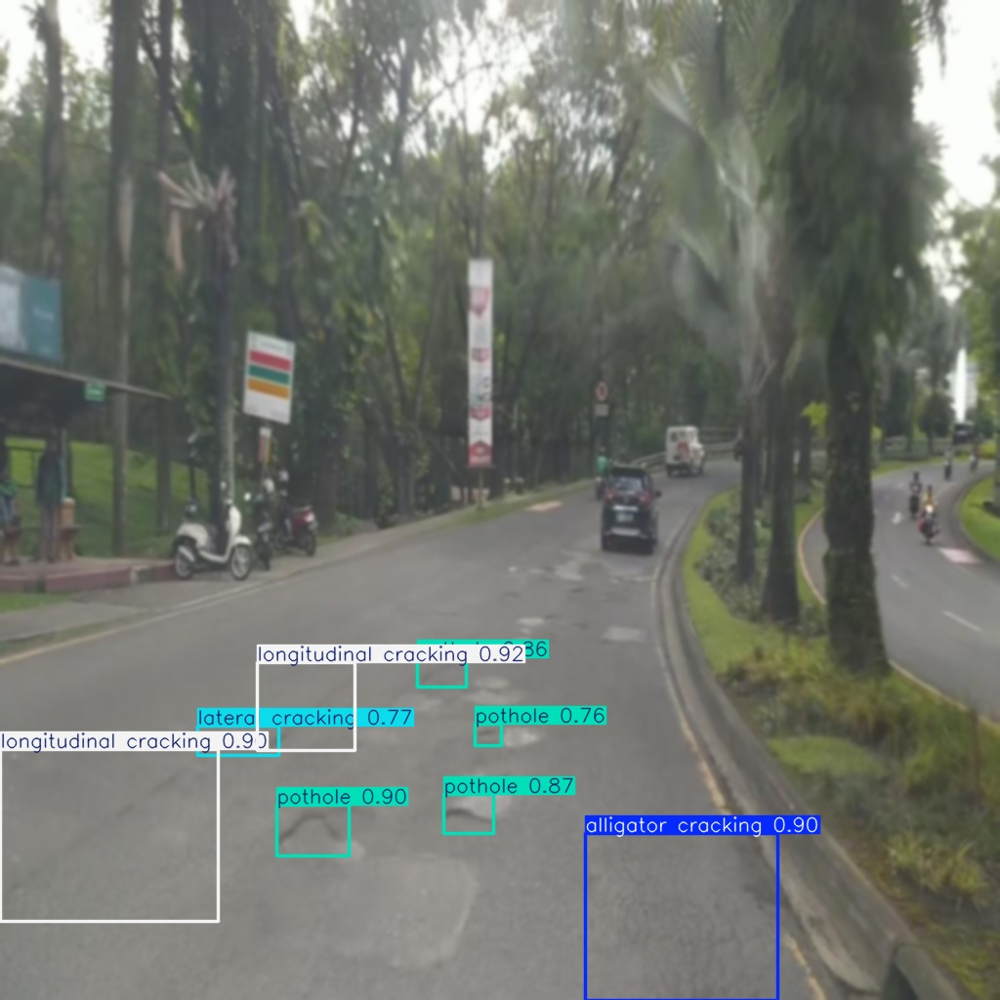

# Road Damage Detection Using YOLO26

A computer vision project evaluating the effect of data augmentation on YOLO26s for multi-class road damage detection.

The project compares two YOLO26s models trained under the same experimental setup:

- **YOLO26s without data augmentation**
- **YOLO26s with data augmentation**

The models were evaluated using quantitative performance metrics and robustness testing under different visual conditions.

---

## Overview

Road damage detection is an important application of computer vision that can help automate the identification of damaged road surfaces.

This project focuses on detecting four types of road damage:

- Alligator Cracking
- Lateral Cracking
- Longitudinal Cracking
- Potholes

A public dataset containing **3,321 annotated road-damage images** was used for the experiment.

The dataset was divided into:

- **80% Training**
- **10% Validation**
- **10% Testing**

Two YOLO26s models were trained using the same training configuration, with data augmentation being the primary difference between the two experiments.

---

## Experimental Approach

### Baseline Model

The first YOLO26s model was trained using the original dataset without additional data augmentation.

This model serves as the baseline for evaluating the effect of augmentation.

### Augmented Model

The second YOLO26s model was trained using data augmentation techniques including:

- Horizontal flipping
- Rotation
- Hue adjustment
- Saturation adjustment
- Brightness adjustment
- Blur

Both models were trained under the same experimental configuration to allow a direct comparison of their performance.

---

## Results

### Model Performance

The augmented model demonstrated substantial improvements across all evaluated metrics.

| Metric | Without Augmentation | With Augmentation | Improvement |
|---|---:|---:|---:|
| Precision | 72.8% | **87.8%** | +15.0% |
| Recall | 65.3% | **85.9%** | +20.6% |
| F1-score | 68.9% | **86.8%** | +17.9% |
| mAP@50 | 70.5% | **90.9%** | +20.4% |
| mAP@50–95 | 34.4% | **58.4%** | +24.0% |

The results show that the augmented model outperformed the baseline model across all evaluated metrics.

---

## Detection Results

The following examples compare predictions from the two models, with the model trained without augmentation shown on the left and the augmented model shown on the right.

| Without Augmentation | With Augmentation |
|---|---|
|  |  |

The augmented model generally produced more complete detections, particularly for smaller and more complex road-damage patterns.

---

## Robustness Evaluation

The models were further evaluated under different visual transformations to examine their robustness under altered image conditions.

The robustness evaluation included:

- Brightness
- Blur
- Hue
- Rotation
- Saturation

The following examples highlight the model behavior under brightness and blur transformations.

### Brightness

| Without Augmentation | With Augmentation |
|---|---|
|  |  |

### Blur

| Without Augmentation | With Augmentation |
|---|---|
|  |  |

The augmented model generally demonstrated more stable detection performance under altered visual conditions, with improved detection consistency and reduced misclassification or duplicate detections.

---

## Key Findings

### Performance

Data augmentation resulted in significant improvements in every evaluated metric:

- **Precision:** 72.8% → **87.8%**
- **Recall:** 65.3% → **85.9%**
- **F1-score:** 68.9% → **86.8%**
- **mAP@50:** 70.5% → **90.9%**
- **mAP@50–95:** 34.4% → **58.4%**

### Detection

The augmented model showed more balanced detection across the four road-damage classes and improved sensitivity toward smaller and more complex crack patterns.

### Robustness

The augmented model generally showed greater stability when images were subjected to changes in brightness, blur, hue, rotation, and saturation.

---

## Trained Models

The trained model weights are included in the `models/` directory.

| Model | Description |
|---|---|
| `best_non_augmented.pt` | YOLO26s baseline model trained without augmentation |
| `best_augmented.pt` | YOLO26s model trained with data augmentation |

The **augmented model** represents the final model from the experimental comparison.

---

## Dataset

This project uses the **Road Damage Indonesia Dataset**, published by **Kantor** on Roboflow Universe.

**Dataset:** [Road Damage Indonesia Dataset](https://universe.roboflow.com/kantor-uskvs/road-damage-indonesia)

The dataset contains **3,321 images** covering four road-damage classes:

- Alligator Cracking
- Lateral Cracking
- Longitudinal Cracking
- Potholes

The complete dataset is not included in this repository.

### Dataset Citation

The dataset is provided under the MIT license. The citation provided by Roboflow is:

```bibtex
@misc{road-damage-indonesia_dataset,
  title = {Road Damage Indonesia Dataset},
  type = {Open Source Dataset},
  author = {Kantor},
  howpublished = {\url{https://universe.roboflow.com/kantor-uskvs/road-damage-indonesia}},
  url = {https://universe.roboflow.com/kantor-uskvs/road-damage-indonesia},
  journal = {Roboflow Universe},
  publisher = {Roboflow},
  year = {2023},
  month = {oct}
}
